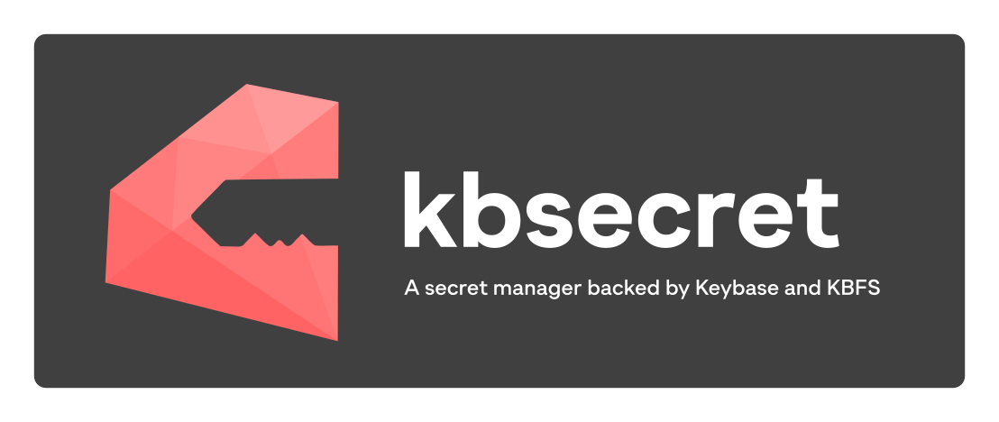

========

[](https://badge.fury.io/rb/kbsecret)
[](https://travis-ci.org/kbsecret/kbsecret)
[](https://codecov.io/gh/kbsecret/kbsecret)

KBSecret é uma utilidade de linha de comando e biblioteca para gerenciar *segredos*.

Links rápidos:

* [Instruções de instalação](https://kbsecret.github.io/#/install/)
* [Guia de início rápido](https://kbsecret.github.io/#/quickstart/)
* [Documentação CLI](https://kbsecret.github.io/man/kbsecret.1.html)
* [Documentação API](http://www.rubydoc.info/gems/kbsecret/)
* [Customizando sua instalação](https://kbsecret.github.io/#/customize/)

## Hackeando no KBSecret

Quer hackear no KBSecret? Aqui esta como você pode começar:

```bash
$ git clone git@github.com:kbsecret/kbsecret.git && cd kbsecret
$ bundle install --path vendor/bundle
$ bundle exec ./bin/kbsecret help
```

### Páginas de Manual

As páginas de manual do KBSecret podem ser encontradas online
[aqui](https://kbsecret.github.io/man/kbsecret.1.html).

Se você gostaria de gerar as versões roff para `man(1)`, precisará de `ronn(1)`:

```bash
$ bundle exec make man
$ cp man/*.1 ${YOUR_MAN_DIR}
```

### Completação de Shell

KBSecret fornece completação de funcões de shell para bash, zsh e fish.

Para gerar as completações para Bash:

```bash
$ bundle exec make bash
$ # ou, se tiver comandos adicionais que suportem 
$ # a flag --introspect-flags:
$ CMDS='foo bar baz' bundle exec make bash
$ cp completions/kbsecret.bash ${SEU_DIRETORIO_DE_COMPLETACAO}
```

Para usar as completações para zsh, adicione o diretório de completação em seu `$fpath` ou copie o arquivo `completions/_kbsecret` para todos os diretórios contidos nele.

Para user as completações em fish, copie `completions/kbsecret.fish` para sua pasta `~/.config/fish/completions`.

Sinta-se a vontade para contribuir seus scripts de completação para outras shells!

### Contribuindo

Veja ["help wanted"](https://github.com/kbsecret/kbsecret/issues?q=is%3Aissue+is%3Aopen+label%3A%22help+wanted%22)
no [issue tracker](https://github.com/kbsecret/kbsecret/issues).

Se tiver alguma ideia para uma nova funcionalidade, sugira! Pull requests também são bem vindos.

### Comunidade e ajuda

Se você gostaria de ajudar ou simplesmente conversar sobre o desenvolvimento do KBSecret, por favor una-se a nós em
`#kbsecret` no Freenode.

Também temos uma equipe em Keybase. Por favor, nos diga no IRC se gostaria de ser adicionado ao mesmo.

## Licenciamento

KBSecret é licenciado sobre a MIT License.

O logo de KBSecret foi criado por [Arathnim](http://arathnim.me).
